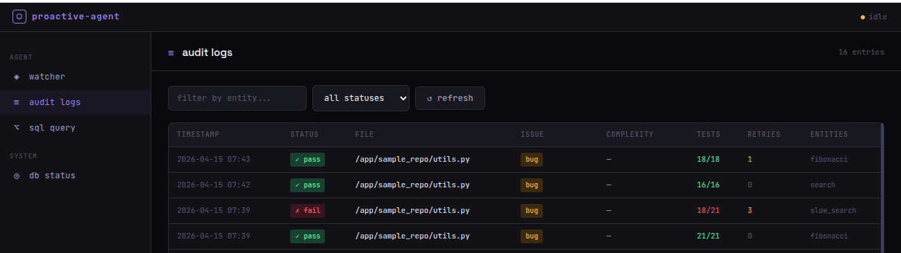
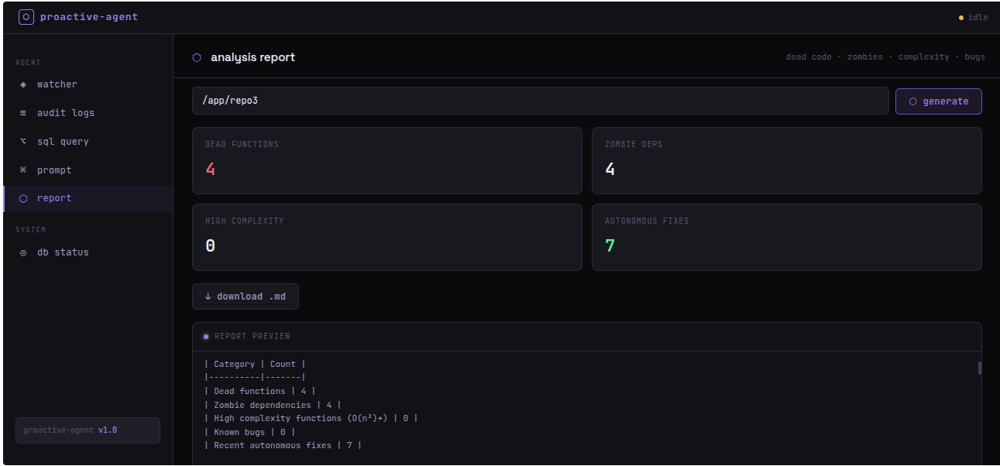
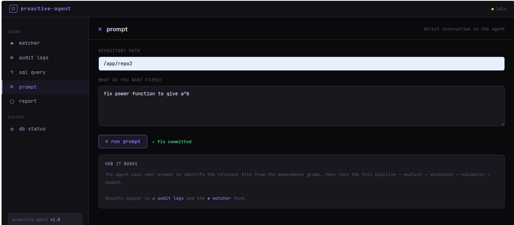
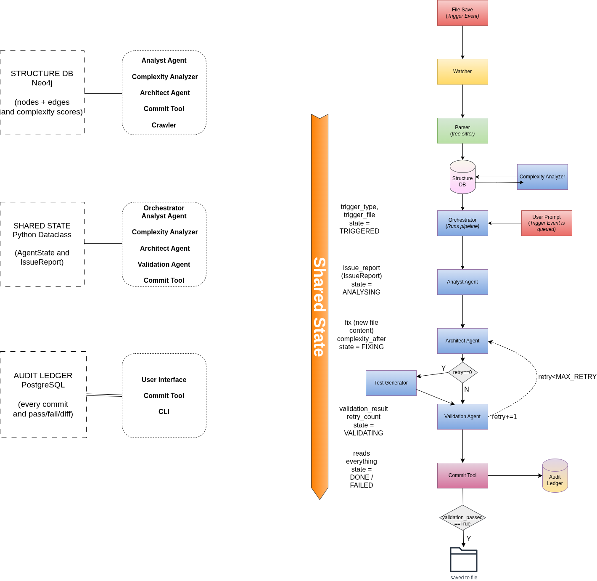

# proactive-agent
A multi-agent, autonomous coding agent that monitors your repository, identifies bugs, performance bottlenecks, dead code, and zombie dependencies. It generates mathematically verified fixes, validates them safely in an isolated sandbox, and commits changes — without a single user prompt.

It is triggered by any file save. Its every action is permanently logged with full oversight through the audit dashboard.
## Demo




## Quickstart
 
**Prerequisites:** Docker, Docker Compose, and an OpenAI API key.
 
```bash
# 1. Clone the repo
git clone https://github.com/dhanges/proactive-agent
cd proactive-agent
 
# 2. Add your API key
cp .env.example .env
# edit .env and add your OPENAI_API_KEY
 
# 3. Start everything
docker compose up
 
# 4. Open the dashboard in your browser
# http://localhost:8000
```
 
Neo4j, Postgres, and the API launch together.
 
**First run:**

1. Enter your repo path in the Watcher panel (e.g. /app/sample_repo)
2. Click Start Watch. It will scan the repository first, then begin watching.
3. Edit any .py file and save; this will trigger the pipeline. You can observe it fire in real time.
## How It Works
 
### The Pipeline
| Step | Component | Action |
|------|-----------|--------|
| 1 | **Parser** | tree-sitter re-parses the changed file |
| 2 | **Structure DB** | Neo4j graph updated with new nodes and relationships |
| 3 | **Complexity Analyser** | Big-O analysis runs on every function (static + LLM) |
| 4 | **Analyst Agent** | Queries the graph, reads source code, identifies the most severe issue |
| 5 | **Architect Agent** | Generates a complete code fix using graph context |
| 6 | **Test Generator** | Generates test cases (first attempt only) |
| 7 | **Validator Agent** | Two-pass validation: baseline run on original file records pre-existing failures, fixed file run passes only if zero regressions introduced |
| 8 | **Commit Tool** | Applies fix to disk, writes to audit ledger |

> On validation failure, the Architect retries up to 3 times with the previous error as context.

### Baseline Validation
The validator runs two sandbox passes per fix:

**Pass 1 — Baseline:** Runs tests against the original unmodified file. Records which tests were already failing before any fix.
**Pass 2 — Fixed file:** Runs the same tests against the patched file.
A fix passes if `fixed_failures − baseline_failures = ∅` — no previously-passing test now fails. Pre-existing failures in unrelated functions are ignored entirely. This means a fix to `bubble_sort` is never blocked by a pre-existing bug in `get_first`.

### The Three Databases

| Database | Technology | Purpose |
|----------|-----------|---------|
| Structure DB | Neo4j | Live dependency graph of the entire codebase — files, functions, classes, call relationships, inheritance, complexity scores |
| Shared State | Python dataclass | Working memory passed between agents during one pipeline run |
| Audit Ledger | PostgreSQL | Permanent record of every commit — what changed, why, complexity before/after, test results |

### The Agents
**Complexity Analyzer**
Two-layer Big-O analysis. Layer 1 is rule-based static analysis using tree-sitter AST patterns — handles O(1), O(n), O(n²), O(n log n), O(n³) without any LLM calls. Layer 2 sends uncertain cases (recursion, while loops, break) to GPT-4o. Runs on every file change before the Analyst.

**Analyst Agent**
Queries Neo4j for the changed file's dependency context, reads the source code, and identifies one issue by strict priority: (1) guaranteed runtime errors, (2) user prompt requests, (3) time complexity O(n²) or worse. Returns a structured IssueReport with exact line numbers and entities involved.

**Architect Agent**
Takes the Analyst’s IssueReport and queries Neo4j for full dependency context — what calls this function, what it calls, which class it belongs to. Sends everything to GPT-4o and receives a complete replacement function. In the case of a retry, it includes the previous validation failure as context to prompt a different approach.

**Test Generator**
Given the file and source code, it generates 2-3 test cases (normal input and edge cases) per function and saves them to a 'generated_tests/test_<filename>.py` in the repository. Tests are generated once before the first validation attempt and reused across retries.

**Validation Agent**
Creates an isolated Docker container, copies the fixed file and generated tests into it, runs pytest, captures the output, and returns pass/fail with full test results. The container is destroyed after each run. The real codebase is never touched until validation passes.

**Commit Tool**
Writes the validated fix to disk, records a complete audit entry in PostgreSQL (diff, complexity change, test results, retry count), and updates Neo4j node flags.

### The Structure DB Schema

**Nodes:** Namespace, Package, File, Class, Interface, Function, Method, Variable

**Key relationships:** CONTAINS, IMPORTS, CALLS, INHERITS, IMPLEMENTS, HAS_MEMBER, USES, HAS_PARAMETER

**Key properties on Function/Method nodes:** complexity, complexity_score, is_buggy, start_line, end_line

### Complexity Analysis
 
| Pattern | Complexity | Method |
|---------|-----------|--------|
| No loops, no builtins | O(1) | Static |
| Linear builtins: `set()`, `sum()`, `max()` | O(n) | Static |
| Single input-dependent loop | O(n) | Static |
| Constant range loop: `range(4)` | O(1) | Static |
| Sorting call | O(n log n) | Static |
| Nested loops | O(n²) | Static |
| List comprehension | O(n) | Static |
| While loop | Uncertain | LLM |
| Recursion | Uncertain | LLM |
| Loop with break | Uncertain | LLM |

## Dashboard
 
The web dashboard at `http://localhost:8000` has four panels:
 
**Watcher** — Start/stop file watching, live activity feed showing pipeline events in real time, counters for passed/failed/retried runs.
 
**Audit Logs** — Filterable table of every commit. Filter by entity name or pass/fail status. Shows complexity before/after, test counts, and retry count.
 
**SQL Query** — Direct SQL access to the audit ledger. Write any SELECT query against `audit_ledger`. Preset queries for recent failures, complexity improvements, failure details, and retry statistics.

**User Prompt** — Accepts the filepath and a user prompt and queues it to the analyst for consideration.

**Report** — Generate a full analysis report for any repository. Shows dead code, zombie dependencies, high-complexity functions, known bugs, and autonomous fixes applied. Downloadable as markdown with safe deletion steps per finding.
 
**DB Status** — Live Neo4j node counts by type, buggy node count, and high-complexity node count.

## Tech Stack
 
| Layer | Technology |
|-------|-----------|
| Language | Python 3.11 |
| AST Parser | tree-sitter |
| Structure DB | Neo4j 5 |
| Audit Ledger | PostgreSQL 15 |
| LLM | GPT-4o (OpenAI API) |
| File Watcher | watchdog |
| Sandbox | Docker (ephemeral containers) |
| API | FastAPI + Uvicorn |
| ORM | SQLAlchemy |
| Container Orchestration | Docker Compose |
 
---

## Known Limitations
**Stale Neo4j nodes after function deletion**
When a function is deleted from a file, its Neo4j node persists until the next crawler run. This can cause the Analyst to flag deleted functions. Fixed by clearing the graph when scanning the repository.

**Test regeneration conflicts**
Generated tests are written before the first validation attempt. Because on retries, it was observed that different test regenerations can conflict with each other. The Architect receives the previous failure output as context to guide a different approach.

**Test conflicts across functions**
Tests are generated for the entire file but fixes target one function. Pre-existing failures in other functions are handled by baseline comparison — they are recorded before the fix and ignored during regression checking. The Architect receives the exact list of regressions it introduced as context on retry.

**Single function fix per pipeline run**
The Analyst reports one issue per run — the most severe( a runtime error is more severe than performance optimisation). Multiple issues in the same file are fixed sequentially across successive file saves.

**LLM hallucination on bug detection**
When no complexity issues exist, the Analyst scans all functions for bugs. GPT-4o occasionally flags non-issues (e.g. a function returning an item instead of a boolean when the name implies search). Prompt constraints reduce this, but do not eliminate it.

**Docker-in-Docker path constraints**
The sandbox runs via the host Docker socket. Temp files must be in /tmp (shared between the API container and host). Files in other container-only paths are not visible to sandbox containers.

**Python only**
tree-sitter grammars for JavaScript, TypeScript, Java, and Go are available and can be added. The current implementation only parses .py files.

---
## Project Structure
 
```
proactive-agent/
├── docker-compose.yml       # one command startup
├── Dockerfile               # API container
├── api.py                   # FastAPI backend (13 endpoints)
├── proactive_agent_ui.html  # live dashboard
├── cli.py                   # terminal commands: watch, scan, log, status
├── orchestrator.py          # pipeline coordinator with retry loop
├── analyst_agent.py         # Neo4j-aware bug + complexity detection
├── architect_agent.py       # LLM patch generation with graph context
├── validation_agent.py      # Docker sandbox test runner
├── test_generator.py        # automatic pytest generation per file
├── commit_tool.py           # atomic commits + audit logging
├── complexity_analyzer.py   # two-layer Big-O analysis
├── watcher.py               # debounced file watcher
├── crawler.py               # repo scanner (parse + graph + complexity + tests)
├── parser.py                # tree-sitter AST extraction
├── graph_writer.py          # Neo4j MERGE writes with stale node cleanup
├── sandbox.py               # ephemeral Docker execution
├── ledger.py                # PostgreSQL audit ledger
├── db.py                    # Neo4j connection manager
├── agent_state.py           # typed shared state dataclass
├── .env.example             # API key template
└── requirements.txt
```
---
## CLI
 
```bash
# watch a directory (triggers pipeline on every file save)
python cli.py watch <path>
 
# one-time scan (builds structure DB + generates tests)
python cli.py scan <path>
 
# view audit log
python cli.py log
python cli.py log --limit 50
python cli.py log --entity find_duplicates
 
# view structure DB status
python cli.py status
```
---
 
## Audit Ledger Schema
 
```sql
SELECT timestamp,         -- when the commit happened
       trigger_type,      -- file_watch (or user_prompt)
       affected_file,     -- which file was changed
       issue_type,        -- complexity or bug
       entities_changed,  -- which functions were modified (JSONB)
       complexity_before, -- e.g. O(n²)
       complexity_after,  -- e.g. O(n)
       validation_passed, -- did all tests pass?
       tests_run,         -- total tests executed
       tests_passed,      -- tests that passed
       retry_count,       -- architect retries needed
       improvement,       -- human-readable summary
       sandbox_output     -- full pytest output
FROM audit_ledger
ORDER BY timestamp DESC;
```
## API Endpoints

| Method | Endpoint | Description |
|--------|----------|-------------|
| GET | `/api/status` | Neo4j node counts |
| GET | `/api/log` | Audit ledger entries |
| POST | `/api/watch/start` | Start file watcher |
| POST | `/api/watch/stop` | Stop file watcher |
| POST | `/api/scan` | One-time repo scan |
| POST | `/api/prompt` | User-initiated pipeline |
| POST | `/api/sql` | Run SELECT against audit ledger |
| GET | `/api/graph/check` | Check if path is crawled |
| GET | `/api/feed` | Live pipeline feed messages |
| GET | `/api/analysis/dead-code` | Functions with no callers |
| GET | `/api/analysis/zombies` | Declared deps never imported |
| POST | `/api/report` | Full markdown analysis report |
| GET | `/api/queue/status` | Current pipeline queue state |
